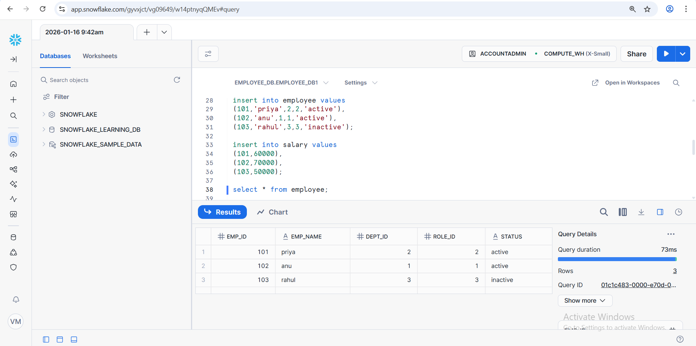
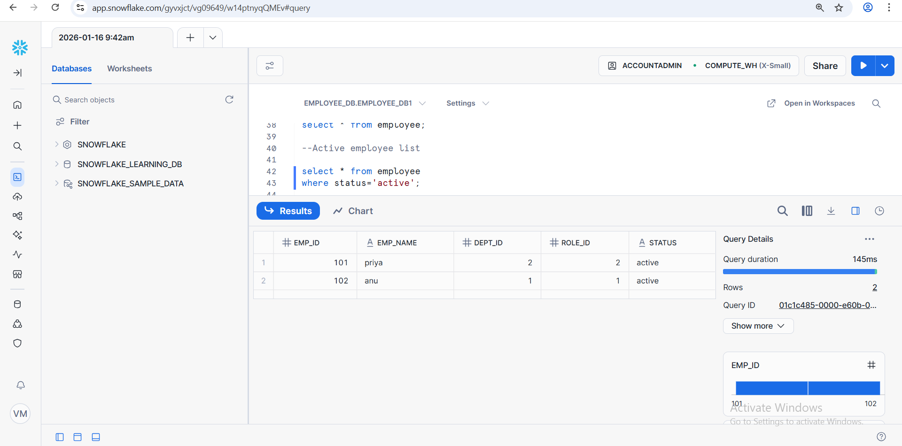
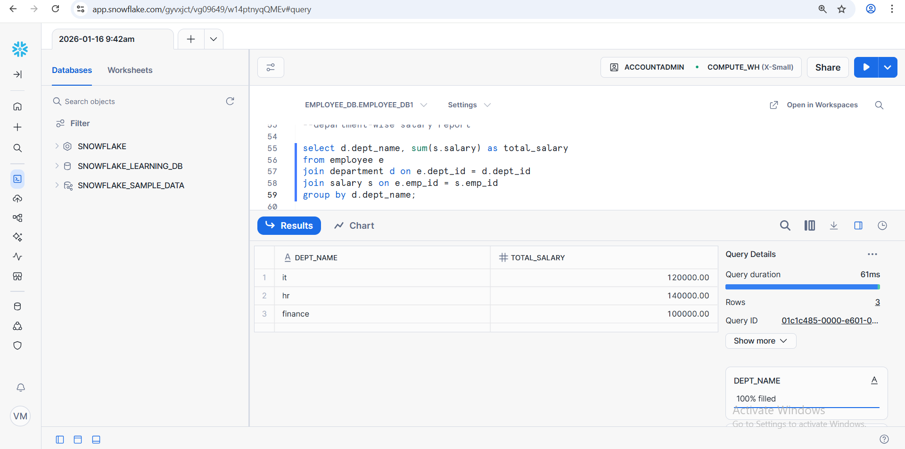

# SQL Employee Management System (Snowflake)

## 📌 Overview
A simple Employee Management System built using Snowflake SQL.  
This project demonstrates database design, SQL querying, reporting, and GitHub version control.

---

## 🛠 Tech Stack
- Snowflake
- SQL
- GitHub


---

## 📂 Project Structure

```
##sql-employee-management/
├── sql/
│   ├── create_tables.sql
│   ├── insert_data.sql
│   └── queries.sql
├── screenshots/
│   ├── tables_created.png
│   ├── active_employee.png
│   ├── employee_department_role.png
│   └── department_salary.png
└── README.md ```

```
## 🧱 Tables Created
- employee (employee details & status)
- department (department information)
- roles(job roles)
- salary (salary details)

📸 Tables Created in Snowflake  


## 🔍 SQL Queries & Reports

###active Employee

select * from employee
where status='active';

📸


###employee with department & role (JOIN)

select E.emp_name, D.dept_name, R.role_name
FROM employee E
JOIN department D ON E.dept_id= D.dept_id
JOIN roles R ON E.role_id = R.role_id;

📸.png)

###department-wise salary report

select d.dept_name, sum(s.salary) as total_salary
from employee e
join department d on e.dept_id = d.dept_id
join salary s on e.emp_id = s.emp_id
group by d.dept_name;

📸


--department with salary > 60000 (HAVING)

select d.dept_name, sum(s.salary) as total_salary
from employee e
join department d on e.dept_id = d.dept_id
join salary s on e.emp_id = s.emp_id
group by d.dept_name
having sum(s.salary) > 60000;

📸.png)

```

